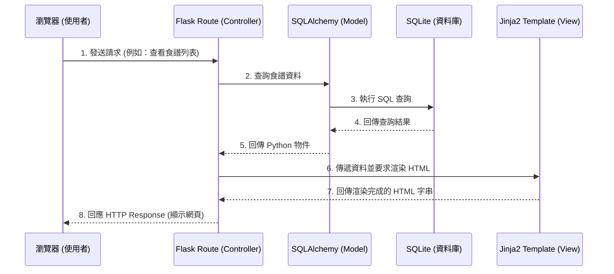

# 系統架構設計 (System Architecture) - 食譜收藏夾

本文件基於 PRD 中的功能需求（新增、搜尋、編輯、刪除食譜與材料管理等），定義了「食譜收藏夾」專案的系統架構、技術選型、資料夾結構與元件關係。

## 1. 技術架構說明

本專案採用傳統的伺服器端渲染 (Server-Side Rendering) 架構，不採用前後端分離，以求快速開發與簡化架構。

### 選用技術與原因
- **後端框架：Python + Flask**
  - **原因**：Flask 輕量、靈活，非常適合開發小型的個人化網站或 MVP（最小可行性產品）。它學習曲線平緩，且能快速搭建出具備核心功能的網頁應用。
- **模板引擎：Jinja2**
  - **原因**：與 Flask 高度整合，能夠在伺服器端將 Python 的資料動態注入 HTML 中（例如：將資料庫撈出的食譜列表渲染成網頁），內建 Autoescape 也能防範基本的 XSS 攻擊。
- **資料庫：SQLite (透過 SQLAlchemy)**
  - **原因**：本專案為個人使用，資料量不大。SQLite 無須額外安裝或設定獨立的資料庫伺服器，直接以檔案形式儲存，非常適合這類輕量級專案。使用 SQLAlchemy 作為 ORM (Object-Relational Mapping)，能有效防範 SQL Injection 並簡化資料庫操作。

### Flask MVC 模式說明
雖然 Flask 本身不強制規定 MVC，但我們會採用類似 MVC (Model-View-Controller) 的概念來組織程式碼：
- **Model (模型)**：負責與 SQLite 資料庫溝通，定義「食譜 (Recipe)」與「材料 (Ingredient)」等資料表的結構。
- **View (視圖)**：負責將資料呈現給使用者，這裡指的是由 Jinja2 渲染出來的 HTML 模板 (`templates/`)，以及前端的 CSS/JS (`static/`)。
- **Controller (控制器)**：由 Flask 的路由 (Routes) 擔任，負責接收使用者的 HTTP 請求（例如：點擊按鈕、提交表單），呼叫 Model 處理資料，最後將資料傳遞給 View 去渲染頁面。

---

## 2. 專案資料夾結構

為了保持專案整潔與可擴充性，我們採用模組化的結構：

```text
web_app_development/
├── app/                      # 應用程式主目錄
│   ├── __init__.py           # 初始化 Flask 應用與套件
│   ├── models/               # 資料庫模型 (Model)
│   │   ├── __init__.py
│   │   └── recipe.py         # 定義 Recipe, Ingredient 等資料表結構
│   ├── routes/               # Flask 路由控制器 (Controller)
│   │   ├── __init__.py
│   │   └── recipe_routes.py  # 處理食譜的 CRUD 與搜尋請求
│   ├── templates/            # Jinja2 HTML 模板 (View)
│   │   ├── base.html         # 共用的版面 (如 Header, Footer)
│   │   ├── index.html        # 首頁 (食譜列表)
│   │   ├── detail.html       # 單一食譜詳細頁面
│   │   └── form.html         # 新增/編輯食譜表單頁面
│   └── static/               # 靜態資源 (CSS, JavaScript, 圖片)
│       ├── css/
│       │   └── style.css
│       └── js/
│           └── main.js
├── instance/                 # 放置不需加入版控的應用程式執行實例資料
│   └── database.db           # SQLite 資料庫檔案
├── docs/                     # 專案文件
│   ├── PRD.md                # 產品需求文件
│   └── ARCHITECTURE.md       # 系統架構文件 (本文件)
├── app.py                    # 專案啟動入口 (主程式)
└── requirements.txt          # Python 依賴套件清單 (例如 flask, flask-sqlalchemy)
```

---

## 3. 元件關係圖

以下說明當使用者在瀏覽器操作時，系統內部的資料流動與元件互動方式：



---

## 4. 關鍵設計決策

1. **採用伺服器端渲染 (SSR) 而非 API + 前端框架 (SPA)**
   - **原因**：針對 MVP 階段，核心需求僅為基本的 CRUD 與搜尋。伺服器端渲染開發速度最快，且可避免在初期就引入過多複雜度（如前後端狀態同步、CORS 問題等）。
2. **採用 SQLAlchemy 作為 ORM**
   - **原因**：雖然可以直接寫 SQL 語法 (sqlite3)，但 SQLAlchemy 能將資料表對映為 Python 類別，使程式碼更具可讀性且易於維護，同時內建防止 SQL Injection 的機制，提升安全性。
3. **路由與模型模組化 (Blueprints 概念)**
   - **原因**：雖然是小型專案，但一開始就將路由 (`routes/`) 與模型 (`models/`) 分開管理，避免所有程式碼擠在單一 `app.py` 中。這有助於後續加入「標籤分類」等新功能時的擴充。
4. **單一資料庫檔案 (SQLite)**
   - **原因**：系統主要為個人使用，不會有高併發寫入的情境。SQLite 不需要維護資料庫伺服器，直接以 `instance/database.db` 存在，不僅備份方便，也能滿足效能需求。
