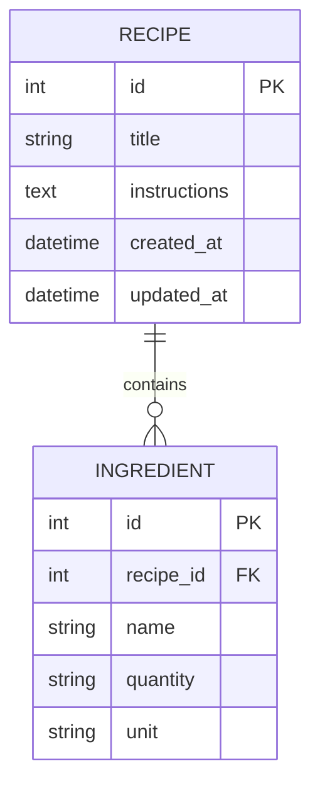

# 資料庫設計 (Database Design) - 食譜收藏夾

本文件基於 PRD 與系統架構文件，定義了食譜收藏夾所使用的 SQLite 資料表結構與關聯。

## 1. ER 圖（實體關係圖）

目前系統的核心為食譜 (Recipe) 以及食譜所需的材料 (Ingredient)，兩者為一對多的關聯 (One-to-Many)。

## 2. 資料表詳細說明

### 2.1 `recipes` (食譜表)
儲存食譜的基本資訊與作法步驟。

| 欄位名稱 | 型別 | 必填 | 說明 |
| :--- | :--- | :---: | :--- |
| `id` | INTEGER | 是 | Primary Key (PK)，自動遞增的唯一識別碼 |
| `title` | VARCHAR(100) | 是 | 食譜名稱 (例如：咖哩飯) |
| `instructions` | TEXT | 是 | 料理步驟與作法說明 |
| `created_at` | DATETIME | 是 | 建立時間，預設為當下時間 |
| `updated_at` | DATETIME | 是 | 最後更新時間，每次修改時自動更新 |

### 2.2 `ingredients` (材料表)
儲存每道食譜對應的各項食材資訊。

| 欄位名稱 | 型別 | 必填 | 說明 |
| :--- | :--- | :---: | :--- |
| `id` | INTEGER | 是 | Primary Key (PK)，自動遞增的唯一識別碼 |
| `recipe_id` | INTEGER | 是 | Foreign Key (FK)，關聯至 `recipes.id`，若食譜刪除則級聯刪除 (CASCADE) |
| `name` | VARCHAR(50) | 是 | 食材名稱 (例如：洋蔥) |
| `quantity` | VARCHAR(50) | 否 | 數量 (例如：1, 1/2, 半) |
| `unit` | VARCHAR(20) | 否 | 單位 (例如：顆, 杯, 克) |

## 3. 實作位置與原始碼

為了方便開發與維護，我們產出了以下檔案：
- **SQL 建表語法**：位於 `database/schema.sql`，可直接於 SQLite 執行。
- **Python SQLAlchemy Model**：位於 `app/models/recipe.py`，定義了 `Recipe` 與 `Ingredient` 類別，並實作了便捷的 CRUD 方法。

資料庫實體檔案將儲存於 `instance/database.db` 中。
