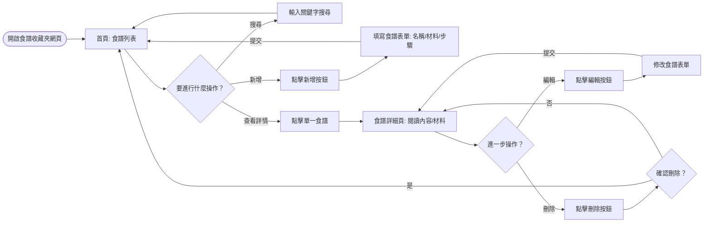
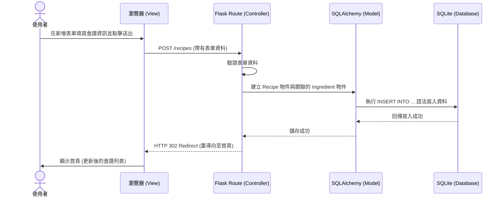

# 系統與使用者流程圖 (Flowcharts) - 食譜收藏夾

本文件基於 `docs/PRD.md` 與 `docs/ARCHITECTURE.md` 的規劃，視覺化使用者的操作路徑與系統內部的資料流動。

## 1. 使用者流程圖 (User Flow)

此流程圖描述使用者從進入首頁開始，如何瀏覽與操作各項食譜功能。

## 2. 系統序列圖 (Sequence Diagram)

此序列圖以「新增食譜」為例，展示使用者送出表單後，系統各元件（瀏覽器、Flask、SQLite）如何互動以完成操作。

## 3. 功能與路由對照表

根據 PRD 定義的核心功能，我們規劃了以下 URL 路徑與對應的 HTTP 方法：

| 功能描述 | HTTP 方法 | URL 路徑 (Route) | 說明 |
| :--- | :--- | :--- | :--- |
| **瀏覽食譜列表 (首頁)** | GET | `/` | 顯示所有食譜，支援 `?q=keyword` 進行搜尋 |
| **顯示新增食譜表單** | GET | `/recipes/new` | 顯示一個空白表單供使用者填寫 |
| **處理新增食譜請求** | POST | `/recipes` | 接收表單資料並存入資料庫 |
| **檢視食譜詳細內容** | GET | `/recipes/<id>` | 顯示特定 ID 食譜的名稱、步驟與材料 |
| **顯示編輯食譜表單** | GET | `/recipes/<id>/edit` | 顯示帶有原資料的表單供使用者修改 |
| **處理編輯食譜請求** | POST | `/recipes/<id>/edit` | 接收修改後的資料並更新至資料庫 |
| **刪除食譜** | POST | `/recipes/<id>/delete` | 從資料庫中刪除特定 ID 的食譜 |

> **備註**：HTML 原生表單僅支援 `GET` 與 `POST`，因此編輯 (Update) 與刪除 (Delete) 的操作通常會以 `POST` 加上特定的 URL 尾綴來實作。
